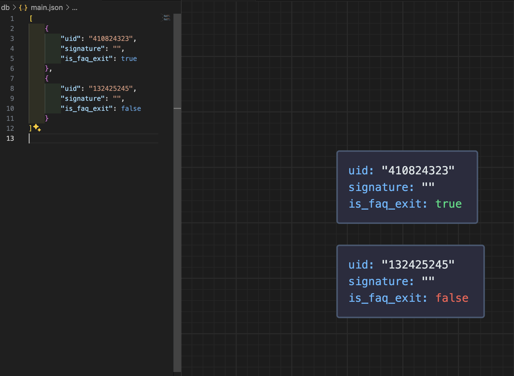

# MongoDB database notes

- A database (with name like Zomato) can have collections
  
  Another example like in case of Netflix, if you want to use multiple databases, then you can have one for
  - movies,
  - web-series,
  - documentaries, etc.

  And then, each database has different collections based on categories like Horror, Comedy, Action, etc.

  But, it's better to create 3 collections than 3 databases as otherwise, you will have some movies common in multiple collections for each database. So, better to create a collection like:

  ```json
  {
    "name": "The Conjuring",
    "type": "Horror",
    "rating": 4.5
  }
  ```

- A collection has documents (of JSON type). You can also imagine like an array of JSON objects/documents.

  > Better to say document than object.

```json
[
  {
    "name": "John",
    "age": 30,
    "city": "New York",
    "hobbies": ["reading", "writing"],
    "address": {
      "street": "123 Main St",
      "city": "New York",
      "zip": "10001"
    }
  },
  {
    "name": "Jane",
    "age": 25,
    "city": "San Francisco"
  },
  {
    "name": "Doe",
    "age": 35,
    "city": "Los Angeles"
  }
]
```

- A document has fields like

```
name: "John"
age: 30
city: "New York"
```


