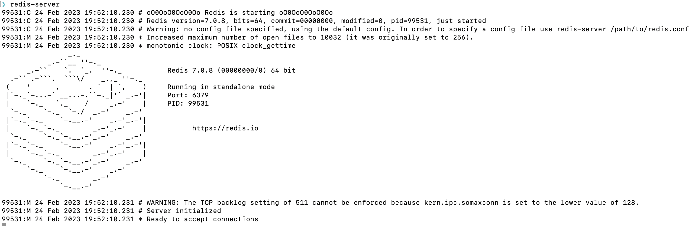
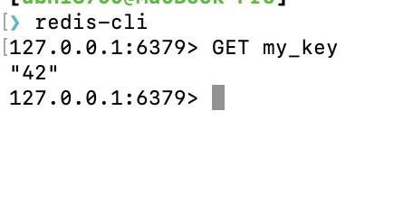
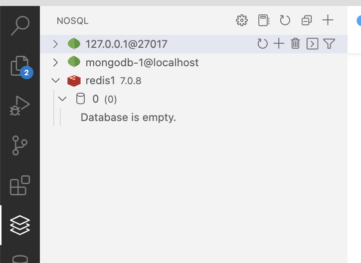
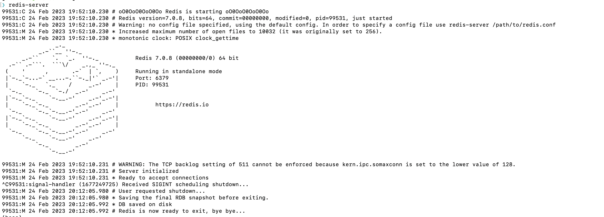
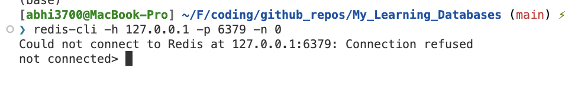
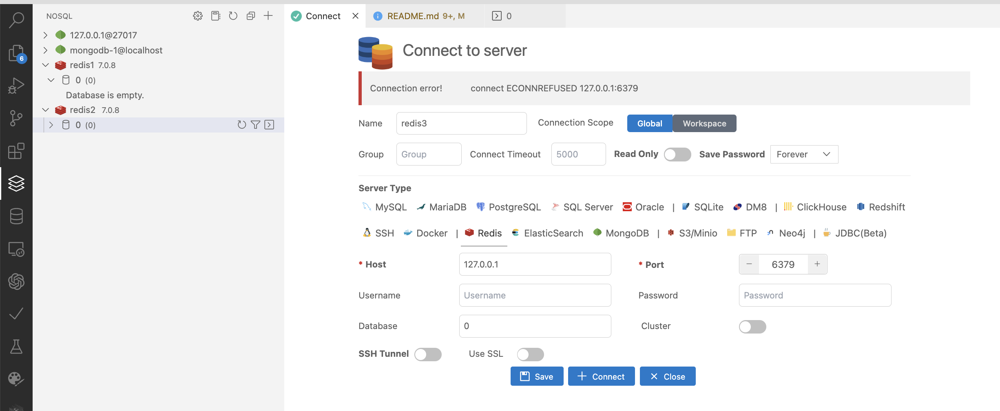

# Redis Database

## Overview

- Redis is an open source (BSD licensed), in-memory data structure store, used as a database, cache and message broker.

## Installation

### ✅ macOS (M1)

```console
$ brew install redis
```

---

Verify installation or start redis server



---

Use the **redis-cli** like this:


---

To stop the server, press <kbd>ctrl+c</kbd> on the terminal.

### ☑️ Ubuntu (via WSL)

- Python - `pip install redis`
- Ubuntu CLI -

  - Install: `$ sudo apt install redis-server`
  - Verify

  ```console
  $ sudo service redis-server start
  Starting redis-server: redis-server.
  ```

## Client

Create local redis DB via VSCode extension via clicking on the <kbd>+</kbd> icon on the left panel of either "NoSQL" or "Database Client" extension:


---

On the left panel, this gets created on "NoSQL" extension.



---

There is a CLI opened on the right panel. This is the redis-cli. Here, you can run any command: CRUD operations, etc.


---

Stop the server looks like this:



Now, the CLI shows like this when trying to access the DB:



Also in VSCode extension:

`Connection error!connect ECONNREFUSED 127.0.0.1:6379`



## Usage/Commands

```console
$ redis-cli
127.0.0.1:6379> get name
"abhijit"
127.0.0.1:6379> delete name
(error) ERR unknown command 'delete'
127.0.0.1:6379> del name
(integer) 1
127.0.0.1:6379> get name
(nil)
127.0.0.1:6379> get keys
(nil)
127.0.0.1:6379> keys
(error) ERR wrong number of arguments for 'keys' command
127.0.0.1:6379>
```

- For more redis-cli commands, visit [here](https://redis.io/docs/ui/cli/)
- Check if a URI is working: It should respond 'PONG'

```console
$ redis-cli -u redis://h:pd4ecec34154bbca551fdeafb94421d0ec41147dab602a6a878e6509ae49f638a@ec2-54-209-85-193.compute-1.amazonaws.com:11989 ping
PONG
```

- set, get data on URI

  ```console
  $ redis-cli -u redis://h:pd4ecec34154bbca551fdeafb94421d0ec41147dab602a6a878e6509ae49f638a@ec2-54-209-85-193.compute-1.amazonaws.com:11989
  ec2-54-209-85-193.compute-1.amazonaws.com:11989> SET name "abhijit"
  OK
  ec2-54-209-85-193.compute-1.amazonaws.com:11989> SET emp_code "CL00102"
  OK
  ec2-54-209-85-193.compute-1.amazonaws.com:11989> GET name
  "abhijit"
  ec2-54-209-85-193.compute-1.amazonaws.com:11989> GET emp_code
  "CL00102"
  ```

- For more redis-cli commands, visit [here](https://redis.io/topics/rediscli)

## Cloud Service Providers

Use redis db instance from external service providers like heroku, render, AWS, etc.

Redis DB hosted on these platforms:

- [Render | All-in-One cloud service](https://dashboard.render.com/) (FREE plan | multiple DB w 30 MB each) comes with TLS support `Tested Ok ✅`
  - steps:
    1. create redis instance with a unique name, noeviction (persistent storage), and 30MB memory (FREE plan).
    2. Now, under "Access Control" of the DB,
       - [ Not preferred for security reason ❌] press <kbd>Use my IP</kbd> button to allow my IP to access the DB
       - [preferred for testing purpose], source: "0.0.0.0/0", description: "Everywhere". This will allow access to DB from anywhere.
    3. Copy the "External Redis URL" and use it in the code as environment variable.
- [Redis Enterprise Cloud](https://app.redislabs.com/) (FREE plan | 1 DB with 30MB ) doesn't have TLS support. `Tested Ok ✅`
- [Heroku](https://dashboard.heroku.com/) (No DBs available in FREE plan) ❌ (not preferred for testing)

## References

- Practice online - https://try.redis.io/
- RedisLab Book (on Redis) - https://redislabs.com/ebook/redis-in-action/
- Add **Heroku Redis** for any product - chatbots, Flask/Django Web App. [RECOMMENDED] For more, refer [here](https://github.com/abhi3700/Telegram_Bot_tutorials/tree/master/server)
- [RedisLab - Geospatial](https://github.com/Altoros/redis-labs-use-cases/tree/master/geospatial)
