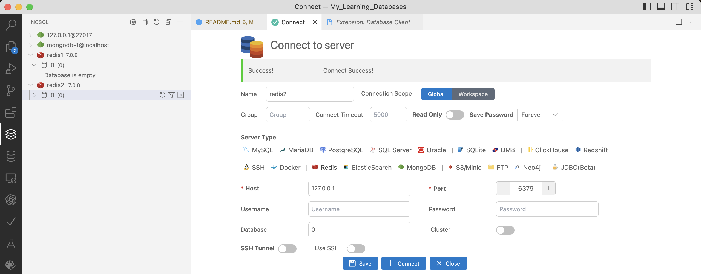
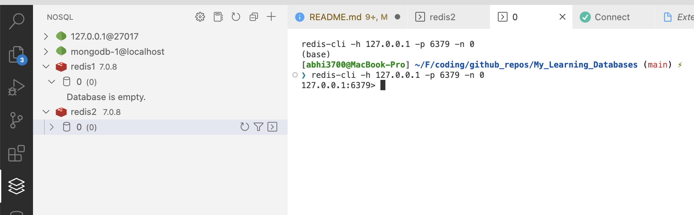

# Redis Database

## Overview

- Redis is an open source (BSD licensed), in-memory data structure store, used as a database, cache and message broker.

## Installation

### ✅ macOS (M1)

```console
brew install redis
```

---

Verify installation or start redis server


---

Use the **redis-cli** like this:


---

To stop the server, press <kbd>ctrl+c</kbd> on the terminal.

### ☑️ Ubuntu (via WSL)

- Python - `pip install redis`
- Ubuntu CLI -

  - Install: `$ sudo apt install redis-server`
  - Verify

  ```console
  $ sudo service redis-server start
  Starting redis-server: redis-server.
  ```

## Client

Create local redis DB via VSCode extension via clicking on the <kbd>+</kbd> icon on the left panel of either "NoSQL" or "Database Client" extension:



---

On the left panel, this gets created on "NoSQL" extension.


---

There is a CLI opened on the right panel. This is the redis-cli. Here, you can run any command: CRUD operations, etc.



---

Stop the server looks like this:


Now, the CLI shows like this when trying to access the DB:


Also in VSCode extension:

`Connection error!connect ECONNREFUSED 127.0.0.1:6379`


## Usage/Commands

```console
$ redis-cli
127.0.0.1:6379> get name
"abhijit"
127.0.0.1:6379> delete name
(error) ERR unknown command 'delete'
127.0.0.1:6379> del name
(integer) 1
127.0.0.1:6379> get name
(nil)
127.0.0.1:6379> get keys
(nil)
127.0.0.1:6379> keys
(error) ERR wrong number of arguments for 'keys' command
127.0.0.1:6379>
```

- For more redis-cli commands, visit [here](https://redis.io/docs/ui/cli/)
- Check if a URI is working: It should respond 'PONG'

```console
$ redis-cli -u redis://h:pd4ecec34154bbca551fdeafb94421d0ec41147dab602a6a878e6509ae49f638a@ec2-54-209-85-193.compute-1.amazonaws.com:11989 ping
PONG
```

- set, get data on URI

  ```console
  $ redis-cli -u redis://h:pd4ecec34154bbca551fdeafb94421d0ec41147dab602a6a878e6509ae49f638a@ec2-54-209-85-193.compute-1.amazonaws.com:11989
  ec2-54-209-85-193.compute-1.amazonaws.com:11989> SET name "abhijit"
  OK
  ec2-54-209-85-193.compute-1.amazonaws.com:11989> SET emp_code "CL00102"
  OK
  ec2-54-209-85-193.compute-1.amazonaws.com:11989> GET name
  "abhijit"
  ec2-54-209-85-193.compute-1.amazonaws.com:11989> GET emp_code
  "CL00102"
  ```

- For more redis-cli commands, visit [here](https://redis.io/topics/rediscli)

## Cloud Service Providers

Use redis db instance from external service providers like heroku, render, AWS, etc.

Redis DB hosted on these platforms:

- [Render | All-in-One cloud service](https://dashboard.render.com/) (FREE plan | multiple DB w 30 MB each) comes with TLS support `Tested Ok ✅`
  - steps:
    1. create redis instance with a unique name, noeviction (persistent storage), and 30MB memory (FREE plan).
    2. Now, under "Access Control" of the DB,
       - [ Not preferred for security reason ❌] press <kbd>Use my IP</kbd> button to allow my IP to access the DB
       - [preferred for testing purpose], source: "0.0.0.0/0", description: "Everywhere". This will allow access to DB from anywhere.
    3. Copy the "External Redis URL" and use it in the code as environment variable.
- [Redis Enterprise Cloud](https://app.redislabs.com/) (FREE plan | 1 DB with 30MB ) doesn't have TLS support. `Tested Ok ✅`
- [Heroku](https://dashboard.heroku.com/)
  - Redis Cloud (FREE plan | 1 DB with 30MB)
  - Rest cloud providers are with paid plans.

## Advanced

### Avoid dynamic Lua script

This pertains to 2 things:

- Avoid generating key names dynamically within the script.
- Run script with `EVALSHA` and a saved hash, rather than loading the script every time.
- Periodically flush the script cache with `SCRIPT FLUSH` command.

The tip from Redis Insight advises against generating dynamic Lua scripts, as each unique script consumes memory when loaded into Redis’s script cache. Over time, this can lead to uncontrolled growth of the Lua script cache, potentially impacting performance. To mitigate this, it’s recommended to use parameterized scripts and manage the script cache by periodically flushing it with the SCRIPT FLUSH command.

In your case, you’re using Lua scripts to automate multiple read/write operations in a single database request, executing them with EVALSHA and a saved hash. This approach aligns with best practices, as it involves loading the script once and reusing it, thereby avoiding the pitfalls associated with dynamic script generation.

However, it’s crucial to ensure that your Lua scripts do not hardcode or programmatically generate key names. In a Redis Cluster setup, all keys accessed by a script must be explicitly provided as input arguments. Accessing keys with programmatically generated names or based on the contents of data structures stored in the database can lead to issues, as the script might attempt to access keys that reside on different nodes, causing errors. 

To ensure compatibility with Redis Cluster, always pass the keys your script will access through the KEYS array, and avoid generating key names within the script itself. This practice ensures that all keys are correctly routed to the appropriate cluster node, maintaining the atomicity and consistency of your operations.

In summary, while your current use of EVALSHA with saved hashes is appropriate, it’s essential to manage your Lua scripts carefully, especially in a clustered environment. Ensure that all keys are passed explicitly, monitor Lua memory consumption, and periodically flush the script cache to maintain optimal performance.

## References

- ~~Practice online - <https://try.redis.io/>~~ [DEPRECATED]
- RedisLab Book (on Redis) - <https://redislabs.com/ebook/redis-in-action/>
- Add **Heroku Redis** for any product - chatbots, Flask/Django Web App. [RECOMMENDED] For more, refer [here](https://github.com/abhi3700/Telegram_Bot_tutorials/tree/master/server)
- [RedisLab - Geospatial](https://github.com/Altoros/redis-labs-use-cases/tree/master/geospatial)
- [Tutorial on Redis Lua Scripting](https://www.squash.io/tutorial-on-redis-lua-scripting/)
