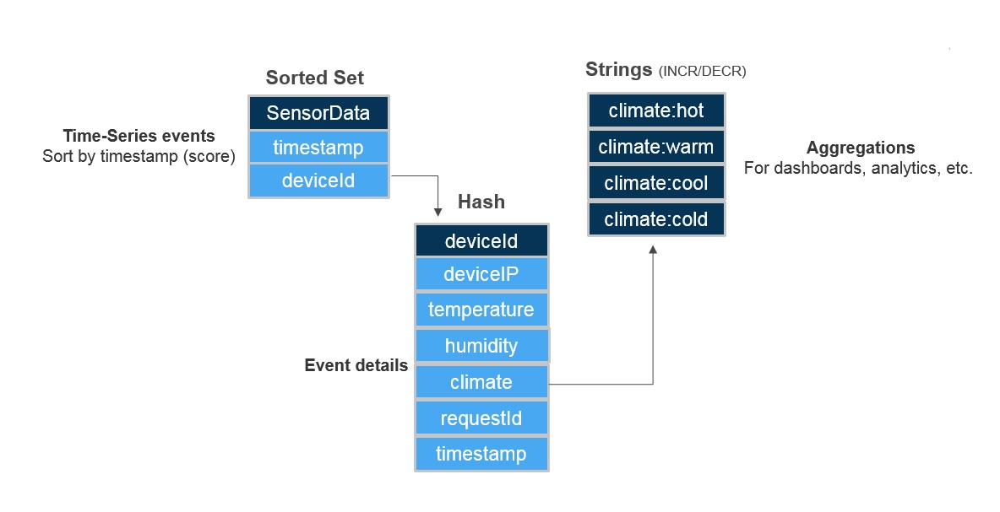
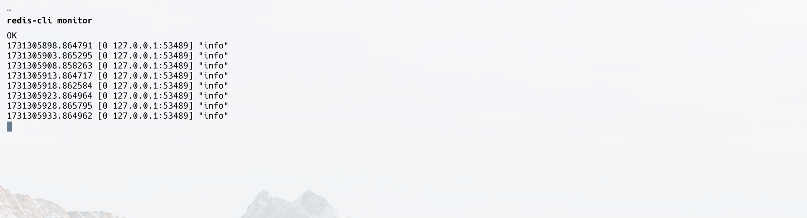
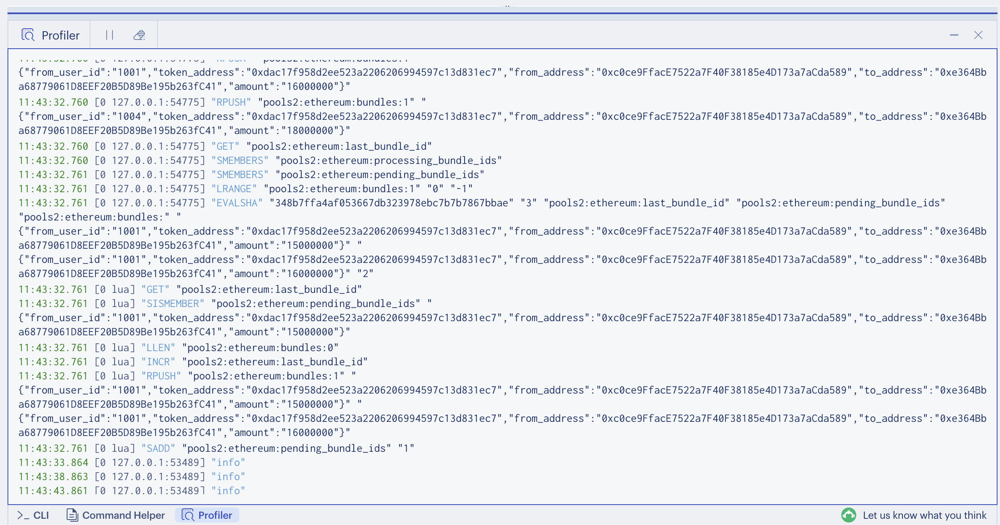
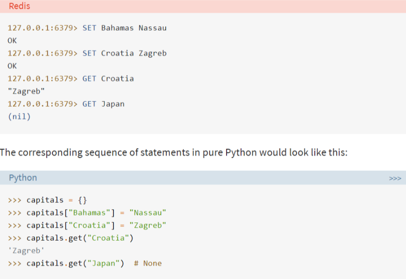
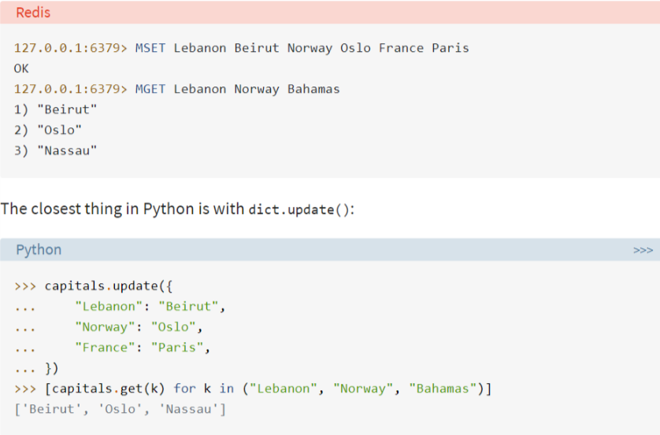
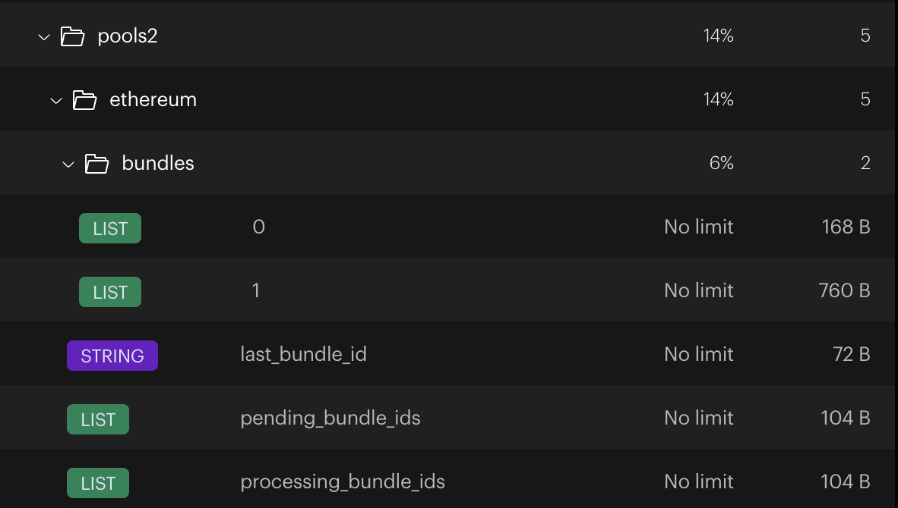

# Redis



## Commands

[All commands](https://redis.io/commands)

---

- `redis-cli ping`: to check if the redis server is running.

```sh
$ redis-cli PING
PONG
```

- `redis-cli`: to access the redis server. By default, it runs on `localhost:6379`. Enters into interactive mode.
- `redis-cli --loglevel verbose`: to get more verbose logging.
- `redis-server`: to start the redis server.
- `redis-cli --scan --pattern '*'`: to scan the keys without blocking the server (especially useful in production).

<details>
<summary>Usage</summary>

```sh
$ redis-cli --scan --pattern '*'
"sample_session:234567890"
"sample_session:890123456"
"bike:1"
"sample_session:123456789"
"sample_jobQueue:ticket:103"
"sample_leaderboard:tetris"
"sample_session:990011223"
"sample_session:334455667"
"sample_session:012345678"
"sample_session:556677889"
"sample_jobQueue:ticket:102"
"sample_session:778899001"
"sample_session:345678901"
"sample_session:789012345"
"sample_session:112233445"
"sample_session:456789012"
"sample_session:901234567"
"sample_session:567890123"
"sample_jobQueue:ticket:101"
"sample_session:678901234"
"sample_jobQueue:waitingList"
```

</details>

- `redis-cli --scan --pattern 'pools2:Ethereum:*' | xargs redis-cli DEL`: to delete all keys starting with `pools2:Ethereum:`. This is useful in production DB. Basically, it scans all keys starting with `pools2:Ethereum:` & then for each of them execute `redis-cli DEL` command on CLI, for which it uses `xargs` (bash) command.
- `redis-cli -h <host> -p <port>`: to connect to a redis server running on a different host or port.
- `info keyspace`: to get the number of keys in the database.
- `info memory`: to get the memory usage of the database.
- `info clients`: to get the number of clients connected to the database.

<details>
<summary>Usage</summary>

```sh
$ info clients
# Clients
connected_clients:5
cluster_connections:0
maxclients:10000
client_recent_max_input_buffer:16896
client_recent_max_output_buffer:0
blocked_clients:0
tracking_clients:0
clients_in_timeout_table:0
total_blocking_keys:0
total_blocking_keys_on_nokey:0
```

</details>

- `info stats`: to get the stats of the database.
- `info server`: to get the server info.

<details>
<summary>Usage</summary>

```sh
$ info server
# Server
redis_version:7.2.6
redis_git_sha1:00000000
redis_git_dirty:0
redis_build_id:9bb279ad39b0d83e
redis_mode:standalone
os:Darwin 23.6.0 arm64
arch_bits:64
monotonic_clock:POSIX clock_gettime
multiplexing_api:kqueue
atomicvar_api:c11-builtin
gcc_version:4.2.1
process_id:38938
process_supervised:no
run_id:6b4ceeed4d7b16ed117fe7d86a5d9f67d2f4aefa
tcp_port:6379
server_time_usec:1731179834949760
uptime_in_seconds:12598
uptime_in_days:0
hz:10
configured_hz:10
lru_clock:3126586
executable:/Users/abhi3700/redis-server
config_file:
io_threads_active:0
listener0:name=tcp,bind=*,bind=-::*,port=6379
```

</details>

- `GET <key>`: to get the value of a key.

## Profiler | Monitoring

In order to monitor the redis server, we can use the `MONITOR` command. This will print out all the commands that are being executed on the server to the terminal. This can be very useful in debugging & monitoring the server.
> NOTE: You can view all logs including the script logs.

<details>
<summary><b>Using CLI via <code>redis-cli monitor</code> command in a separate terminal</b></summary>



</details>

It will keep printing the commands in the terminal until we stop it. To stop it, we can press `Ctrl + C`.

---

There is another way to monitor i.e. using **"Redis Insight"** tool.

<details>
<summary><b>Using Redis Insight</b></summary>



</details>

## Data Structure

> NOTE:
>
> - All keys are always `string` type.
> - But, values can be of - `string`, `list`, `hashes`, and `sets`. Some advanced types include `geospatial` items and the new stream type.
> - We can also set expiry to a key. This is useful in scenarios like session expiry, cache expiry, etc.

### 1. key:value

**DB Structure:**

```json
{
  "Bahamas": "Nassau",
  "Croatia": "Zagreb"
}
```



More complex ones:

```sh
> set tx1 '{"from_user_id":"1001","token_address":"0xdac17f958d2ee523a2206206994597c13d831ec7","from_address":"0xc0ce9FfacE7522a7F40F38185e4D173a7aCda589","to_address":"0xe364Bba68779061D8EEF20B5D89Be195b263fC41","amount":"15000000"}'
OK
```

Also,

```sh
> set pools:Ethereum:tx1 '{"from_user_id":"1001","token_address":"0xdac17f958d2ee523a2206206994597c13d831ec7","from_address":"0xc0ce9FfacE7522a7F40F38185e4D173a7aCda589","to_address":"0xe364Bba68779061D8EEF20B5D89Be195b263fC41","amount":"15000000"}'
OK

> get pools:Ethereum:tx1
"{\"from_user_id\":\"1001\",\"token_address\":\"0xdac17f958d2ee523a2206206994597c13d831ec7\",\"from_address\":\"0xc0ce9FfacE7522a7F40F38185e4D173a7aCda589\",\"to_address\":\"0xe364Bba68779061D8EEF20B5D89Be195b263fC41\",\"amount\":\"15000000\"}"
```

### 2. Multiple key:value

**DB Structure:**

```json
{
  "Lebanon": "Beirut",
  "Norway": "Oslo",
  "France": "Paris"
}
```



### 3. Hashes

**DB Structure:**

```json
{
  "user:1": {
    "username": "abhi3700",
    "location": "mohali",
    "name": "abhijit",
    "birthyear": "1996",
    "job": "India"
  }
}
```

- Input:

```console
> hmset user:1 username abhi3700 location mohali
> hmset user:1 name abhijit birthyear 1996 job India
```

Output:

```console
> hget user:1 name
"abhijit"

> hgetall user:1
1) "username"
2) "abhi3700"
3) "location"
4) "mohali"
5) "name"
6) "abhijit"
7) "birthyear"
8) "1996"
9) "job"
10) "India"
```

### 4. Lists

**DB Structure:**

Use of `rpush` & `lrange`

```json
{
  "emp_list": ["Abhijit Roy", "Anuvesh", "Vijay", "Girish", "Abhishek"]
}
```

- Input:

```console
> rpush emp_list2 "Abhjit Roy"
(integer) 1
> rpush emp_list2 "Anuvesh"
(integer) 2
> rpush emp_list2 "Vijay"
(integer) 3
> rpush emp_list2 "Girish"
(integer) 4
> rpush emp_list2 "Abhishek"
(integer) 5
```

- Output:

```console
> lrange emp_list2 0 -1
1) "Abhjit Roy"
2) "Anuvesh"
3) "Vijay"
4) "Girish"
5) "Abhishek"
```

**DB Structure:**

Use of `lpop` & `lpush`

```json
{
  "emp_list": ["Abhijit Roy", "Anuvesh", "Vijay", "Girish", "Abhishek"]
}
```

- Input:

```console
> rpop emp_list2
"Abhishek"
> lpop emp_list2
"Abhjit Roy"
```

- Output:

```console
> lrange emp_list2 0 -1
1) "Anuvesh"
2) "Vijay"
3) "Girish"
```

### 5. Sets

Sets are very useful when you want to store a list of unique items.

More:

- No duplication
- Unordered. So, can't remove from a specific index. That's why no such command like `lpop`, `rpop`, `lpush`, `rpush`.
- In Lua scripts for redis atomic transactions, sets could be more efficient than lists when trying to find if an element exists. Because in lists, we have to iterate through the entire list to find if an element exists. Whereas, in sets, we can directly check if the element exists using `sismember` command.

---

Usage:

- `sadd <key> <value>`: to add a value to a set.

  ```sh
  sadd foo 1 2 3
  (integer) 3
  ```

- `smembers <key>`: to get all values of a set.

  ```sh
  smembers foo
  1) "1"
  2) "2"
  3) "3"
  ```

- `scard <key>`: to get the number of elements in a set.

  ```sh
  > scard foo
  (integer) 3
  ```

- `srem <key> <value>`: to remove a value from a set.

  ```sh
  > srem foo 2
  (integer) 1
  > smembers foo
  1) "1"
  2) "3"
  ```

- `sismember <key> <value>`: to check if a value exists in a set. If exists, returns `1`. Otherwise, returns `0`.

  ```sh
  > sismember foo 1
  (integer) 1
  > sismember foo 2
  (integer) 0
  ```

- `sunion <key1> <key2> ...`: to get the union of two or more sets.

  ```sh
  foo: 1 3
  bar: 3 4 5 69
  ```

  ```sh
  > sunion foo bar
  1) "1"
  2) "3"
  3) "4"
  4) "5"
  5) "69"
  ```

- `sdiff <key1> <key2> ...`: to get the difference between two or more sets. Basically, the values that are present in the first set but not in the subsequent sets. NOTE: Order matters. Also, the value of 1st set has to be present in either of the subsequent sets to not be considered in the result.

  ```sh
  foo: 1 3
  bar: 3 4 5 69
  ```

  ```sh
  > sdiff foo bar
  1) "1"
  ```

  Another example:

  ```sh
  SADD set1 "a" "b" "c" "d"
  SADD set2 "c"
  SADD set3 "a" "c" "e"
  ```

  To find elements in set1 that are not in set2 or set3:

  ```sh
  > sdiff set1 set2 set3
  1) "b"
  2) "d"
  ```

  Here,

- `a` of set1 is present in set3.
- `b` of set1 is neither present in set2 nor set3.
- `c` of set1 is present in set2.
- `d` of set1 is neither present in set2 nor set3.

---

### 6. Sorted Sets

Here, score is the value by which the elements are ordered & rank is the position of the element in the sorted set.

- Add a member/value with a score to a sorted set: `zadd <key> <score> <value>`

  ```sh
  # returns no. of elements added
  zadd hello 1 1
  (integer) 1
  ```

- Get the rank/index/position of a member/value: `zrank <key> <value>`

  ```sh
  # returns no. of elements added
  zrank hello 1
  (integer) 0
  ```

  NOTE: In case of unsorted set, the command is `SISMEMBER` instead of `ZRANK`.
  
  If not found, returns `nil`.

- Get the score/key of a member/value: `zscore <key> <value>`

  ```sh
  zscore hello 1
  "1"
  ```

  NOTE: In case of unsorted set, the command is `SISMEMBER` instead of `ZSCORE`.

  If not found, returns `nil`.

- Add multiple elements to same score:

  ```sh
  # returns no. of elements added
  zadd hello 1 4
  (integer) 1
  ```

- Add multiple elements with different scores to a sorted set:

  ```sh
  zadd hello 1 4 2 5
  (integer) 1
  ```

  As (1, 4) is already added, so only (2, 5) is added.

- Get all elements of a sorted set: `zrange <key> <start> <stop> [WITHSCORES]`

  ```sh
  # returns array of elements
  zrange hello 0 -1
  1) "1"
  2) "4"
  3) "5"
  ```

- Get length of a sorted set: `zcard <key>`

  ```sh
  # returns no. of elements
  zcard hello
  (integer) 3
  ```

### Example | Pools

```json
{
  "pools": {
    "Ethereum": {
      "last_bundle_id": 1,
      "processing_bundle_ids": [0],
      "pending_bundle_ids": [1],
      "bundles": {
        "1": [
          {
            "from_user_id": "1001",
            "token_address": "0xdac17f958d2ee523a2206206994597c13d831ec7",
            "from_address": "0xc0ce9FfacE7522a7F40F38185e4D173a7aCda589",
            "to_address": "0xe364Bba68779061D8EEF20B5D89Be195b263fC41",
            "amount": "15000000"
          },
          {
            "from_user_id": "1002",
            "token_address": "0xdac17f958d2ee523a2206206994597c13d831ec7",
            "from_address": "0xc0ce9FfacE7522a7F40F38185e4D173a7aCda589",
            "to_address": "0xe364Bba68779061D8EEF20B5D89Be195b263fC41",
            "amount": "15000000"
          }
        ]
      }
    }
  }
}
```

- To create this data using CLI:

```sh
set pools:Ethereum last_bundle_id 1
rpush pools:Ethereum:processing_bundle_ids 1
rpush pools:Ethereum:processing_bundle_ids 2
rpush pools:Ethereum:pending_bundle_ids 3 4
# 440 B for 1st hash & thereafter 280 B for each additional field
hset pools:Ethereum:bundles 1 '{"from_user_id": "1001", "token_address": "0xdac17f958d2ee523a2206206994597c13d831ec7", "from_address": "0xc0ce9FfacE7522a7F40F38185e4D173a7aCda589", "to_address": "0xe364Bba68779061D8EEF20B5D89Be195b263fC41", "amount": "15000000"}'

# Add PendingTx object to the bundles's bundle_id (1)
rpush pools:Ethereum:bundles:1 '{"from_user_id": "1001", "token_address": "0xdac17f958d2ee523a2206206994597c13d831ec7", "from_address": "0xc0ce9FfacE7522a7F40F38185e4D173a7aCda589", "to_address": "0xe364Bba68779061D8EEF20B5D89Be195b263fC41", "amount": "15000000"}'
```

- Increase the `last_bundle_id` by 1:

```sh
incr pools:Ethereum last_bundle_id
```

- Get the pending_bundle_ids & processing_bundle_ids:

```sh
lrange pools:Ethereum:pending_bundle_ids 0 -1
lrange pools:Ethereum:processing_bundle_ids 0 -1
```

- push a bundle_id (1) to `processing_bundle_ids`:

```sh
rpush pools:Ethereum:processing_bundle_ids 1
```

- remove a bundle_id (4) from `pending_bundle_ids` & add it to `processing_bundle_ids`:

```sh
# lrem <key> <count> <value>
lrem pools:Ethereum:bundles 0 4
rpush pools:Ethereum:processing_bundle_ids 4
```

> NOTE: In `lrem`, `count` is the number of occurrences to remove from the list. 0 means all occurrences.

- Remove the entire pool of Ethereum:
  

```sh
redis-cli KEYS 'pools2:Ethereum:*' | xargs redis-cli DEL

# For production, use the following command:
redis-cli --scan --pattern 'pools2:Ethereum:*' | xargs redis-cli DEL
```

List all matching keys starting with `pools2:Ethereum:` & then run `xargs` command to delete each of them with `redis-cli DEL` command.
> This can be a heavy process run in production. So, expect some delay.
>
> NOTE: `xargs` is a UNIX command, not part of redis.

---

## Lua Scripts

In order to avoid to & fro communication between the client & server, we can use Lua scripts to execute multiple commands in a single execution. Redis Lua Scripting allows you to perform **atomic operations**, ensuring that multiple Redis commands are executed as a single atomic operation. This is particularly useful when you need to update multiple keys or perform complex operations that require consistency.

Like to get "Hello it's Monday, but has a meeting on Blockchain", we can use a Lua script to execute the following commands in a single execution:

```lua
local day = redis.call('get', 'day')
if not day then
  return 'Hello it\'s Monday, but has a meeting on Blockchain'
end
local meeting_topic = redis.call('get', 'meeting_topic')
if not meeting_topic then
  return 'Hello it\'s ' .. day .. ', but has no meeting'
end

return 'Hello it\'s ' .. day .. ', but has a meeting on ' .. meeting_topic
```

And then run the script using the `EVAL` command or inside a rust program.

```sh
eval "return \"Hello it's \" .. KEYS[1] .. \" but has a meeting on \" .. KEYS[2]" 2 Monday Blockchain
```

> NOTE: Please note that `2` is the number of keys that the script will use. `..` is used to concatenate the strings. We don't have {} type formatting in Lua. Also, in LUA, the index starts from 1.

### Put inside Rust 🦀

This is an example code to show how a Lua script can be put inside a Rust program:

```rust
async fn get_first_pending_bundle(
 con: &mut MultiplexedConnection,
 chain_name: &str,
) -> eyre::Result<Vec<PendingPaymentTx>> {
 let pending_bundle_ids_key = format!("pools2:{chain_name}:pending_bundle_ids");
 let bundles_key_prefix = format!("pools2:{chain_name}:bundles:");

 let lua_script = r#"
    local pending_bundle_id = redis.call('LINDEX', KEYS[1], 0)
    if not pending_bundle_id then
        return {nil, {}}
    end
    local bundles_key = KEYS[2] .. pending_bundle_id
    local bundles = redis.call('LRANGE', bundles_key, 0, -1)
    return {pending_bundle_id, bundles}
    "#;

 let script = Script::new(lua_script);
 let result: Vec<PendingPaymentTx> = script
  .key(pending_bundle_ids_key)
  .key(bundles_key_prefix)
  .invoke_async(con)
  .await?;

 println!("Bundle's pending txs: {:#?}", result);

 Ok(result)
}
```

Here,

- You can parse key(s) depending on how many DB keys are used in the script.
- You can also parse `argv` depending on how many values to be used. Like insert transactions in a bundle. So, then transactions (serialized string) could be parsed into `argv`.
- `Script::new(lua_script)` creates a new Lua script with the provided Lua code.
- `.key(pending_bundle_ids_key)` adds the `pending_bundle_ids_key` as a key argument to the script.
- `.key(bundles_key_prefix)` adds the `bundles_key_prefix` as a key argument to the script.
- `.invoke_async(con)` invokes the script asynchronously using the provided connection.

### Logging

While running Lua scripts on Redis DB server, you might require to log the output to DB server's terminal, which can be done adding this line in the script:

```lua
redis.log(redis.LOG_NOTICE, "Hello, this is a log message")
redis.log(redis.LOG_NOTICE, "ARGV[1]: " .. ARGV[1])
redis.log(redis.LOG_NOTICE, "ARGV[2]: " .. ARGV[2])
redis.log(redis.LOG_NOTICE, "ARGV[3]: " .. ARGV[3])
redis.log(redis.LOG_NOTICE, "last_bundle_id: " .. last_bundle_id)
```

We can put inside the script (wherever used like inside Rust code). Then we get to see logs in the DB server's terminal like this:

```sh
38938:M 11 Nov 2024 00:44:43.235 * old_bundle_len: 0
38938:M 11 Nov 2024 00:44:43.235 * ARGV[1]: {"from_user_id":"1001","token_address":"0xdac17f958d2ee523a2206206994597c13d831ec7","from_address":"0xc0ce9FfacE7522a7F40F38185e4D173a7aCda589","to_address":"0xe364Bba68779061D8EEF20B5D89Be195b263fC41","amount":"15000000"}
38938:M 11 Nov 2024 00:44:43.235 * ARGV[2]: {"from_user_id":"1001","token_address":"0xdac17f958d2ee523a2206206994597c13d831ec7","from_address":"0xc0ce9FfacE7522a7F40F38185e4D173a7aCda589","to_address":"0xe364Bba68779061D8EEF20B5D89Be195b263fC41","amount":"16000000"}
38938:M 11 Nov 2024 00:44:43.235 * ARGV[3]: 2
38938:M 11 Nov 2024 00:44:43.235 * last_bundle_id: 0
```

## Redis-Python

`r` - instance of redis client

- Get all DB's keys: `r.keys()`
- Delete keys in a database using `for` loop

```py
for item in r.keys():
    r.delete("{0}".format(item.decode('utf-8')))
```

### Examples

- #### **Hash**: dictionary (including nested)

```json
{
  "+918145634656": {
    "product_a": {
      "username": "abhi3701",
      "country": "India",
      "key": "Alltest2438542342374",
      "datetime": "2019-09-29"
    }
  }
}
```

**Code:** setting the database & get the `username` value

```py
phoneno1 = '+918146734455'
uname1 = 'abhi3701'
country1 = "India"

phoneno2 = '+918147424326734455'
uname2 = 'abhi3702'
country2 = "US"

phoneno3 = '+91565461474243267344'
uname3 = 'abhi3703'
country3 = "Canada"

# setting the database
r.hset(phoneno1, 'product_a', json.dumps(dict(username= uname1)))
r.hset(phoneno2, 'product_a', json.dumps(dict(username= uname2)))
r.hset(phoneno3, 'product_a', json.dumps(dict(username= uname3)))


# get the `username` of `phoneno1`
print(json.loads(r.hget(phoneno1, 'product_a').decode('utf-8')).get('username'))
# OR
print(json.loads(r.hget(phoneno1, 'product_a').decode('utf-8'))['username'])
```

**Code:** find the key i.e. `phoneno1` corresponding to a username value - `abhi3702`

```py
key_phone = ""

for k in r.keys():
    dict_root = json.loads(r.hget(k.decode('utf-8'), "product_a"))
    if dict_root['username'] == 'abhi3702':
        key_phone = k.decode('utf-8')

print(key_phone)
```

- #### **Set**: Immutable list

```py
"""push the breeds into a set"""
r.sadd('breeds_set', str(breed_list))   # set members of a set
breed_list_get = r.smembers('breeds_set')   # get members of a set
e = next(iter(breed_list_get)).decode('utf-8')  # e --> element
```

- #### **List**: Mutable list

```py
"""push the item into breeds list from behind"""
for b in breed_list:
    r.rpush('breeds_list', b)    # insert from right side of the list
print(f'first breed: {r.lindex('breeds_list', 0).decode('utf-8')}')    # first item
```

- #### **Key**: the root keys of the database

```py
"""print all root keys"""
for k in r.keys():
  print(k)
```

```py
"""delete all root keys"""
for k in r.keys():
  r.delete(k)
```

```py
"""delete key (set type), before looping in the above for loop"""
keys_list = r.keys()
del keys_list[0]
print(keys_list)
```

```py
"""
In Hash DS, print all keys with their value of (dict, str, int) types
{
  "918145634656": {
        "product_a": {
            "username": "abhi3701",
            "country": "India",
            "key": "Alltest2438542342374"
            "datetime": "2019-09-29"
        },
}
"""
for key in r.keys():
  k_decoded = key.decode('utf-8')
  print(k_decoded)
  print(json.loads(r.hget(key.decode('utf-8'), "product_a").decode('utf-8')))
  print(json.loads(r.hget(key.decode('utf-8'), "product_a").decode('utf-8')).get('username'))
  print(json.loads(r.hget(key.decode('utf-8'), "product_a").decode('utf-8')).get('country'))
  print(json.loads(r.hget(key.decode('utf-8'), "product_a").decode('utf-8')).get('key'))
  print(json.loads(r.hget(key.decode('utf-8'), "product_a").decode('utf-8')).get('datetime'))
#--------------------------------------------------------------------------------------
"""
In DS, print all keys with their value of (dict, str, int) types
{
  "918145634656": {
            "username": "abhi3701",
            "breed": "labrador",
        },
}
"""
for key in r.keys():
  k_decoded = key.decode('utf-8')
  print(k_decoded)
  print(json.loads(r.get(key.decode('utf-8')).decode('utf-8')))
  print(json.loads(r.get(key.decode('utf-8')).decode('utf-8')).get('username'))
  print(json.loads(r.get(key.decode('utf-8')).decode('utf-8')).get('breed_choice'))
```
