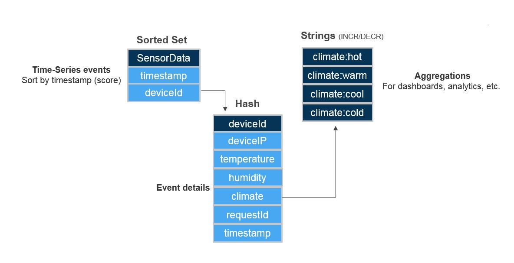
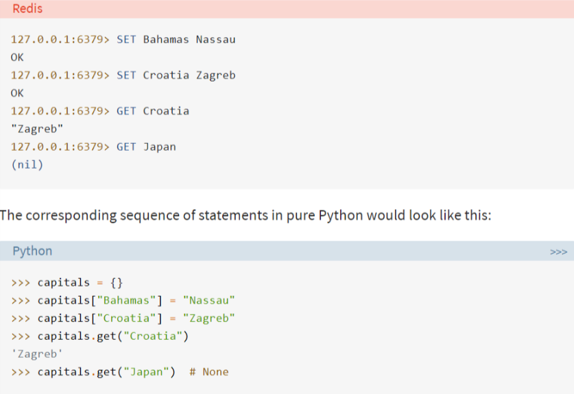
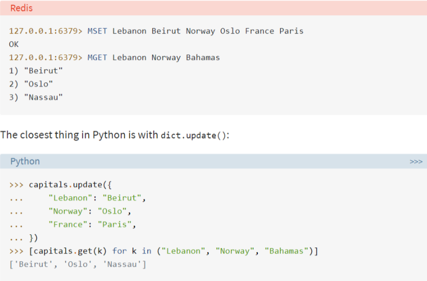

## Redis


## Commands
[All commands](https://redis.io/commands)

## Data Structure
> NOTE:
> - All keys are always string type.
> - But, values can be of - string, list, hashes, and sets. Some advanced types include geospatial items and the new stream type.

### 1. key:value
__DB Structure:__
```json
{
	"Bahamas": "Nassau",
	"Croatia": "Zagreb"
}
```



### 2. Multiple key:value
__DB Structure:__
```json
{
	"Lebanon": "Beirut",
	"Norway": "Oslo",
	"France": "Paris",
}
```


### Hashes
__DB Structure:__
```json
{
	"user:1": {
  		"username": "abhi3700",
  		"location": "mohali",
  		"name": "abhijit",
  		"birthyear": "1996",
  		"job": "India"
	}
}
```
* Input:
```console
> hmset user:1 username abhi3700 location mohali
> hmset user:1 name abhijit birthyear 1996 job India
```
Output:
```console
> hget user:1 name
"abhijit"

> hgetall user:1
1) "username"
2) "abhi3700"
3) "location"
4) "mohali"
5) "name"
6) "abhijit"
7) "birthyear"
8) "1996"
9) "job"
10) "India"
```


## Redis-Python
`r` - instance of redis client
* Get all DB's keys: `r.keys()`
* Delete keys in a database using `for` loop
```py
for item in r.keys():
    r.delete("{0}".format(item.decode('utf-8')))
```

### Examples
* #### __Hash__: dictionary (including nested)
```json
{
"+918145634656": {
    "product_a": {
        "username": "abhi3701",
        "country": "India",
        "key": "Alltest2438542342374",
        "datetime": "2019-09-29",
        }
    }
}
```
__Code:__ setting the database & get the `username` value
```py
phoneno1 = '+918146734455'
uname1 = 'abhi3701'
country1 = "India"

phoneno2 = '+918147424326734455'
uname2 = 'abhi3702'
country2 = "US"

phoneno3 = '+91565461474243267344'
uname3 = 'abhi3703'
country3 = "Canada"

# setting the database
r.hset(phoneno1, 'product_a', json.dumps(dict(username= uname1)))
r.hset(phoneno2, 'product_a', json.dumps(dict(username= uname2)))
r.hset(phoneno3, 'product_a', json.dumps(dict(username= uname3)))


# get the `username` of `phoneno1`
print(json.loads(r.hget(phoneno1, 'product_a').decode('utf-8')).get('username'))
# OR
print(json.loads(r.hget(phoneno1, 'product_a').decode('utf-8'))['username'])
```

__Code:__ find the key i.e. `phoneno1` corresponding to a username value - `abhi3702`
```py
key_phone = ""

for k in r.keys():
    dict_root = json.loads(r.hget(k.decode('utf-8'), "product_a"))
    if dict_root['username'] == 'abhi3702':
        key_phone = k.decode('utf-8')

print(key_phone)
```

* #### __Set__: Immutable list
```py
"""push the breeds into a set"""
r.sadd('breeds_set', str(breed_list))   # set members of a set
breed_list_get = r.smembers('breeds_set')   # get members of a set
e = next(iter(breed_list_get)).decode('utf-8')  # e --> element
```

* #### __List__: Mutable list
```py
"""push the item into breeds list from behind"""
for b in breed_list:
    r.rpush('breeds_list', b)    # insert from right side of the list
print(f'first breed: {r.lindex('breeds_list', 0).decode('utf-8')}')    # first item
```

* #### __Key__: the root keys of the database
```py
"""print all root keys"""
for k in r.keys():
  print(k)
```

```py
"""delete all root keys"""
for k in r.keys():
  r.delete(k)
```

```py
"""delete key (set type), before looping in the above for loop"""
keys_list = r.keys()
del keys_list[0]
print(keys_list)
```

```py
"""
In Hash DS, print all keys with their value of (dict, str, int) types
{
  "918145634656": {
        "product_a": {
            "username": "abhi3701",
            "country": "India",
            "key": "Alltest2438542342374"
            "datetime": "2019-09-29"
        },
}
"""
for key in r.keys():
  k_decoded = key.decode('utf-8')
  print(k_decoded)
  print(json.loads(r.hget(key.decode('utf-8'), "product_a").decode('utf-8')))
  print(json.loads(r.hget(key.decode('utf-8'), "product_a").decode('utf-8')).get('username'))
  print(json.loads(r.hget(key.decode('utf-8'), "product_a").decode('utf-8')).get('country'))
  print(json.loads(r.hget(key.decode('utf-8'), "product_a").decode('utf-8')).get('key'))
  print(json.loads(r.hget(key.decode('utf-8'), "product_a").decode('utf-8')).get('datetime'))
#--------------------------------------------------------------------------------------
"""
In DS, print all keys with their value of (dict, str, int) types
{
  "918145634656": {
            "username": "abhi3701",
            "breed": "labrador",
        },
}
"""
for key in r.keys():
  k_decoded = key.decode('utf-8')
  print(k_decoded)
  print(json.loads(r.get(key.decode('utf-8')).decode('utf-8')))
  print(json.loads(r.get(key.decode('utf-8')).decode('utf-8')).get('username'))
  print(json.loads(r.get(key.decode('utf-8')).decode('utf-8')).get('breed_choice'))
```